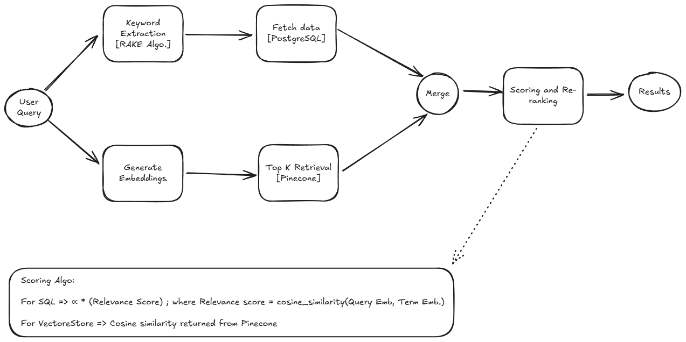

# Hybrid RAG app for Financial Intelligence

### 🔥 **Overview**
The **Financial Intelligence Hub** is a comprehensive RAG-based (Retrieval-Augmented Generation) application designed to **enhance financial knowledge accessibility**.  

---

### **🌟 Features**
### 🔥 **1. Financial Glossary Augmentation Module (RAG)**

- Stores and retrieves financial terms with definitions, simplified explanations, and contextual examples.
- Uses a **hybrid RAG architecture** combining PostgreSQL (structured metadata) and Pinecone (vector search).
- **Efficient retrieval** with SQL filtering + vector store similarity search.
- **Reranking logic** to prioritize relevant results.

### 📰 **2. Financial Market News Summarizer Module**

- Aggregates financial news articles from multiple sources (Google News RSS).
- Extracts and summarizes articles using **LLM-based summarization** (OpenAI GPT Models).
- Stores articles in PostgreSQL with title, content, source, and summary.
- Robust error handling with retries and content extraction.

---

## 🛠️ **Tech Stack**

- **Backend:** Python (FastAPI)
- **Database:** PostgreSQL (structured data storage)
- **Vector Store:** Pinecone (vector embedding retrieval)
- **Embedding Model:** OpenAI Ada-002
- **LLM:** OpenAI GPT (summarization)
- **Web Scraping:** BeautifulSoup4
---

### **💡 How It Works**
**Glossary Augmentation Module Flow Diagram:**


---

### **🔧 How to Run**
1️⃣ **Clone the repository:**
```bash
git clone https://github.com/your-username/financial-intelligence-hub.git
cd financial-intelligence-hub
python -m venv venv
source venv/bin/activate  # Linux/Mac
venv\Scripts\activate    # Windows
```

2️⃣ **Set up environment variables:**
Create a .env file with the following details:
```bash
PINECONE_API_KEY=<YOUR_PINECONE_KEY>  
PINECONE_INDEX_NAME=<YOUR_INDEX_NAME> 
PINCONE_ENV=<YOUR_PINECONE_REGION>

PG_USER=""
PG_PASSWORD=""
PG_HOST=""
PG_PORT=5432
GLOSSARY_DB=glossary

OPENAI_API_KEY=<YOUR_OPENAI_KEY>
```

3️⃣ **Install dependencies:**
```bash
pip install -r requirements.txt
```

4️⃣ **Run the PostgreSQL query:**
```sql
CREATE TABLE glossary (
	id uuid DEFAULT gen_random_uuid() NOT NULL,
	term text NOT NULL,
	definition text NOT NULL,
	simplified_explanation text NULL,
	contextual_examples jsonb NULL,
	created_at timestamp DEFAULT CURRENT_TIMESTAMP NOT NULL,
	updated_at timestamp DEFAULT CURRENT_TIMESTAMP NOT NULL,
	deleted_at timestamp NULL,
	embedded bool NULL
);

CREATE EXTENSION IF NOT EXISTS "uuid-ossp";

CREATE TABLE news_articles (
    id UUID PRIMARY KEY DEFAULT uuid_generate_v4(),
    title TEXT NOT NULL,
    source TEXT NOT NULL,
    url TEXT NOT NULL,
    published_at TIMESTAMP NOT NULL,
    summary TEXT,
    created_at TIMESTAMP DEFAULT CURRENT_TIMESTAMP NOT NULL,
    updated_at TIMESTAMP DEFAULT CURRENT_TIMESTAMP NOT NULL,
    deleted_at TIMESTAMP NULL
);
```

5️⃣ **Run:**
```bash
python main.py
```